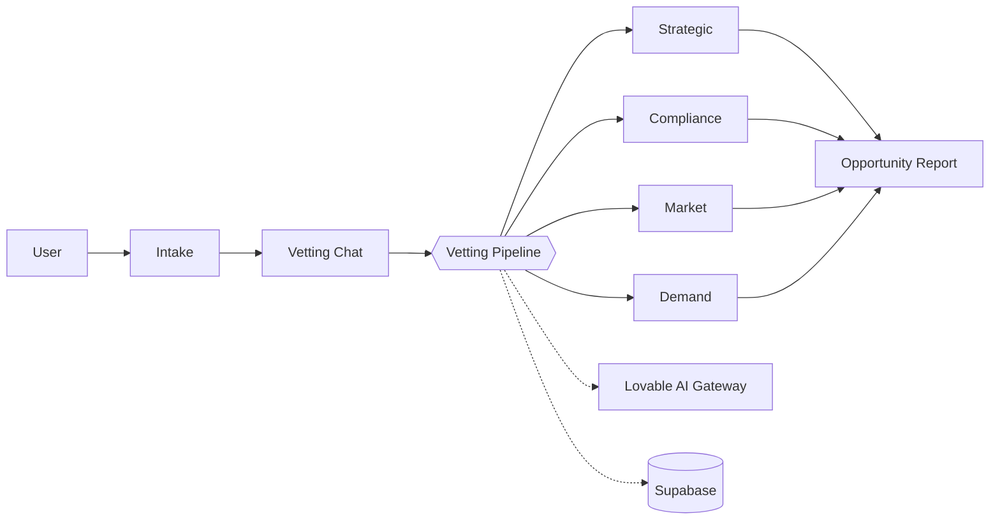

# IdeaForge

Vet raw product concepts with an AI innovation team. IdeaForge runs strategic,
compliance, market, and demand analysis on an idea and turns it into an
actionable opportunity report.

🔗 **Live app:** https://idea411.lovable.app
🛠️ **Edit in Lovable:** https://lovable.dev/projects/db0225c5-7897-4f73-a19c-fc240b555b95

## Tech stack

- **Framework:** [TanStack Start](https://tanstack.com/start) (React 19, SSR)
- **Build:** Vite 7
- **Styling:** Tailwind CSS v4 + shadcn/ui + Radix primitives
- **Data / Auth / Storage:** Supabase (via Lovable Cloud)
- **State:** TanStack Query + TanStack Router
- **Forms / Validation:** react-hook-form + Zod
- **Animation:** Motion
- **Deploy target:** Cloudflare Workers (edge)

## Features

- 🚀 Idea intake → automated vetting pipeline (strategic / compliance / market / sales)
- 💬 Chat-based vetting assistant
- 📊 Market research and opportunity reports (with PDF export)
- 🔐 Email + Google authentication
- 👤 User profile settings (name, title, company, website, avatar)
- 🛡️ Role-based admin panel:
  - Editable prompt templates
  - Skills management
  - User management (grant/revoke admin, password resets, account deletion)
  - Audit log of sensitive admin actions (role changes, password resets, deletions)
- 📱 Installable PWA (Web, Android, iOS) with standalone mode and branded icons
- 🎨 Themed design system with semantic tokens

## Getting started

```bash
# install deps (bun recommended)
bun install

# start the dev server
bun run dev
```

The app runs at `http://localhost:5173` by default.

### Environment

Supabase credentials are auto-provisioned by Lovable Cloud and written to `.env`:

```
VITE_SUPABASE_URL=...
VITE_SUPABASE_PUBLISHABLE_KEY=...
VITE_SUPABASE_PROJECT_ID=...
```

Do not edit `.env` or files under `src/integrations/supabase/` by hand —
they are managed automatically.

## Architecture overview

IdeaForge is a single TanStack Start app that drives a **Concept → Market**
pipeline. The browser renders React routes; all business logic runs in
TanStack **server functions** (`createServerFn`) that talk to Supabase
(Postgres + Storage + Auth) and the Lovable AI Gateway.



The full architecture diagram (services, server functions, RLS-scoped DB
access, admin path) is rendered from
[`docs/architecture.mmd`](docs/architecture.mmd).

**Major services**

| Layer            | Module                                                       | Responsibility                                      |
| ---------------- | ------------------------------------------------------------ | --------------------------------------------------- |
| Auth gate        | `src/routes/_authenticated.tsx`                              | Redirects unauthenticated users to `/auth`          |
| Intake           | `src/routes/_authenticated/intake.tsx`                       | Capture the raw concept                             |
| Vetting chat     | `src/lib/api/vetting-chat.functions.ts`                      | AI Q&A that refines the concept                     |
| Vetting pipeline | `src/lib/api/vetting.functions.ts`                           | Runs strategic / compliance / market / sales passes |
| Market research  | `src/lib/api/market-research.functions.ts`                   | Competitor + trend analysis                         |
| Prompt admin     | `src/lib/api/prompt-templates.functions.ts`                  | Admin-only CRUD over LLM prompt templates           |
| User settings    | `src/lib/api/settings.functions.ts`                          | Profile, avatar (Supabase Storage)                  |
| Data + RBAC      | `supabase/migrations/*`                                      | RLS, `has_role()`, `admin_exists()`, triggers       |


## Project structure

```
src/
  routes/                  # File-based routes (TanStack Router)
    __root.tsx             # App shell
    index.tsx              # Landing page
    _authenticated/        # Auth-gated routes (dashboard, settings, admin…)
  components/
    site/                  # Marketing site sections
    ui/                    # shadcn/ui primitives
  lib/api/                 # Server functions (createServerFn)
  integrations/supabase/   # Auto-generated Supabase clients & types
  styles.css               # Design tokens (oklch) + Tailwind layers
supabase/
  migrations/              # SQL migrations
```

## Server-side logic

Backend logic lives in **TanStack server functions** under `src/lib/api/*.functions.ts`
using `createServerFn` with the `requireSupabaseAuth` middleware. Public webhooks
go under `src/routes/api/public/*`.

## Scripts

| Command            | What it does                          |
| ------------------ | ------------------------------------- |
| `bun run dev`      | Start dev server                      |
| `bun run build`    | Production build                      |
| `bun run preview`  | Preview the production build locally  |
| `bun run lint`     | ESLint                                |
| `bun run format`   | Prettier write                        |

## Deployment

Push to the connected GitHub repo or click **Publish** in the Lovable editor.
The app is built for Cloudflare Workers (nodejs_compat); avoid Node-only
packages in server code.

## License

Private project. All rights reserved.
